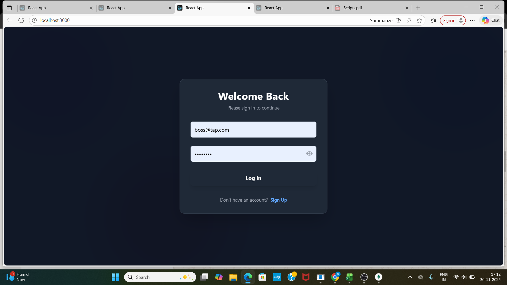
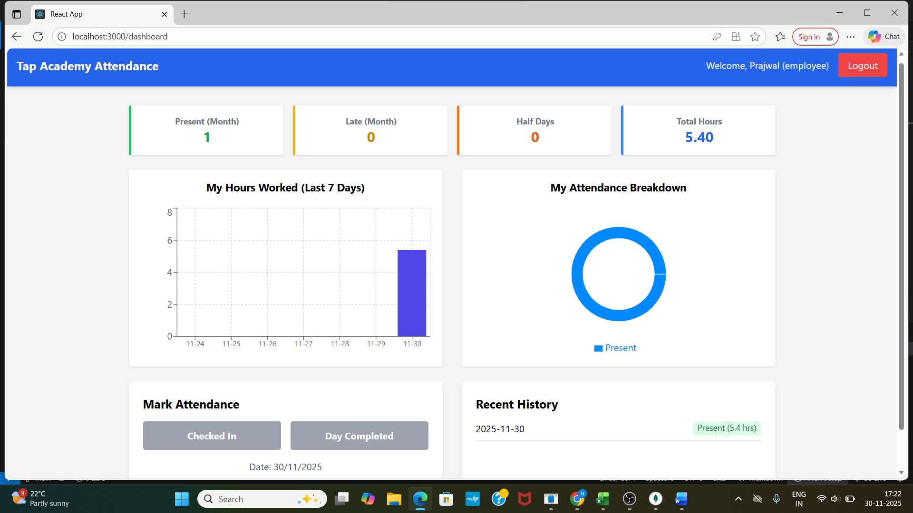
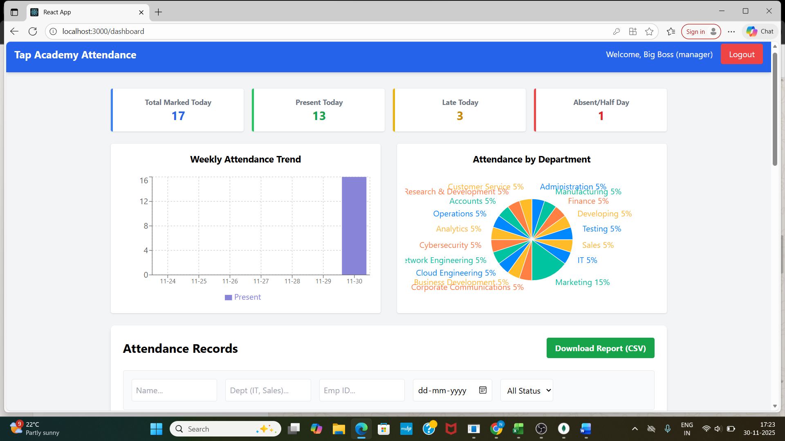
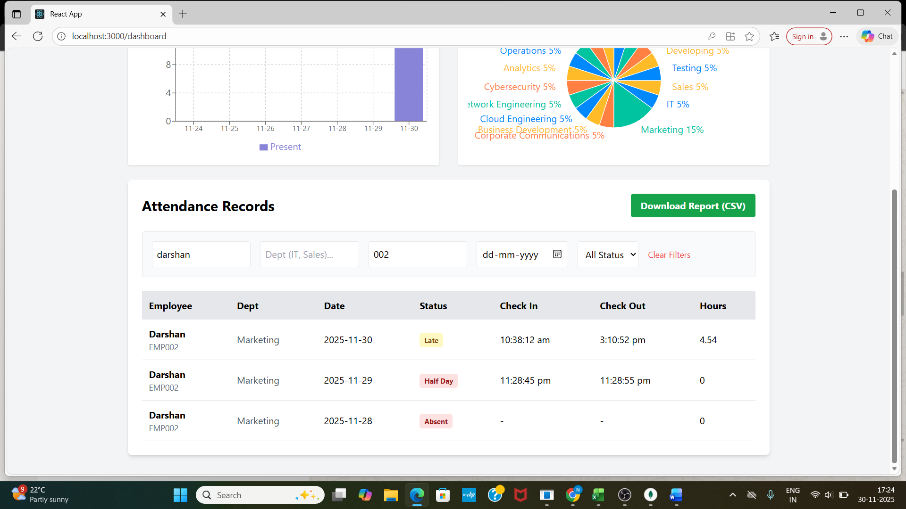

# Employee Attendance Management System

A full-stack MERN application for tracking employee attendance, managing leave status, and generating reports. Built for the Tap Academy SDE Internship Drive.

## 🚀 Tech Stack
- *Frontend:* React.js, Redux Toolkit, Tailwind CSS, Recharts
- *Backend:* Node.js, Express.js
- *Database:* MongoDB
- *Tools:* Axios, BCrypt, JWT, CSV-Writer

## ✨ Features

### 👨‍💼 Employee
- *Secure Login/Registration:* Role-based authentication with a modern dark-themed UI.
- *Mark Attendance:* Real-time Check-In and Check-Out functionality.
- *Smart Logic:* System automatically detects "Late" arrivals (after 10:00 AM) and "Half Day" shifts (< 4 hours worked).
- *Personal Dashboard:* View "Today's Status", "Monthly Stats" (Present, Late, Half Days), and "Recent History".
- *Visuals:* Bar charts showing daily hours worked and pie charts for monthly status distribution.

### 👩‍✈️ Manager
- *Team Monitoring:* View attendance records for the entire organization.
- *Advanced Filters:* Filter records by Employee Name, ID, Department, Date, or Status (Present/Late/Absent).
- *Team Stats:* Real-time overview of who is Present, Late, or Absent today.
- *Export Reports:* One-click download of attendance data as CSV for payroll/HR.
- *Data Visualization:* Weekly attendance trend graphs and department-wise distribution charts.

---

## 📸 Screenshots

### 1. Login Page


### 2. Employee Dashboard


### 3. Manager Dashboard & Filters



---

## 🛠️ Setup & Installation

### 1. Prerequisites
- Node.js (v18 or higher)
- MongoDB (Installed locally or using MongoDB Atlas)

### 2. Installation Steps

*Backend Setup:*
1. Navigate to the server folder:
   ```bash
   cd server
   # Project Setup Guide

## 1. Install Dependencies

### Bash
npm install
---

## 2. Create a .env file in the *server* folder with the following credentials:

### Code snippet
PORT=5000
MONGO_URI=mongodb://127.0.0.1:27017/attendance_db
JWT_SECRET=tapacademy_secret_key
---

## 3. Start the Backend Server

### Bash
npm run dev
(You should see *"Server started on port 5000"* and *"MongoDB Connected"*)

---

## 4. Frontend Setup

### Open a new terminal and navigate to the client folder:

### Bash
cd client
### Install dependencies:

### Bash
npm install
### Start the React App:

### Bash
npm start
(The app will launch at *http://localhost:3000*)

---

## 🔑 Environment Variables

To run this project, you will need to add the following environment variables to your .env file in the server folder:

- *PORT* – Port number (default: 5000)  
- *MONGO_URI* – Your MongoDB Connection String  
- *JWT_SECRET* – Secret key for JWT Token generation  

---

## 👤 Author

*Name:* [ Nagalakshmi N U ]  
*College Name:* [ Adichunchanagiri institute of technology,chikkamagaluru-577102 ]  
*Contact Number:* [ 7483902686 ]

---